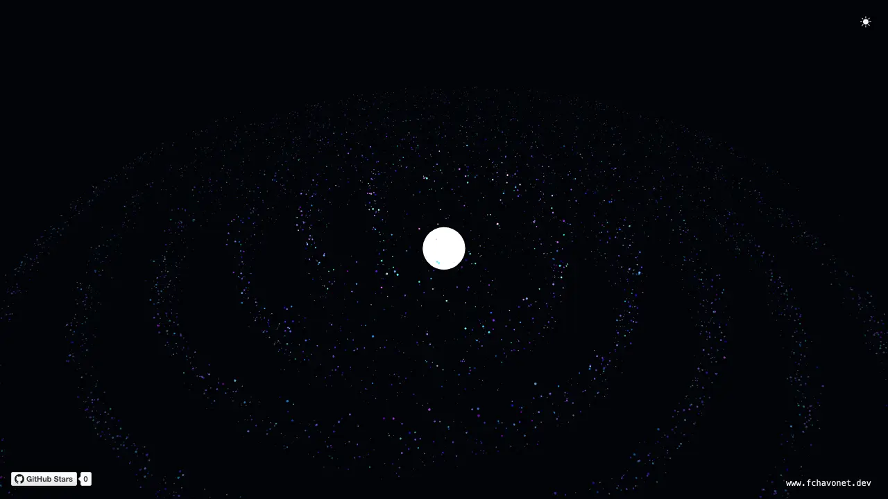

# Galaxy

## Description

This project is a creative coding exploration built with `p5.js`, simulating a rotating spiral galaxy composed of thousands of dynamically animated stars.

Each particle follows a procedurally generated orbit around a radiant galactic core, forming an evolving three-dimensional structure reminiscent of real astronomical systems.

Developed as a study in generative design, particle dynamics, and interactive WebGL rendering, Galaxy demonstrates how complex, organic motion can emerge from simple mathematical rules within a browser environment.

## Objectives

Build a 3D galaxy simulation using `p5.js`.
Experiment with particle motion, angular velocity, and depth-based fading.
Offer a visually immersive experience with minimal code dependencies.

## Tech Stack


## File Description

| **FILE**     | **DESCRIPTION**                                     |
| :----------: | --------------------------------------------------- |
| `assets`     | Contains the resources required for the repository. |
| `index.html` | Main HTML structure for the project.                |
| `style.css`  | Styles and animations for the project.              |
| `script.js`  | Behavior script for interactivity.                  |
| `README.md`  | The README file you are currently reading 😉.       |

## Installation & Usage

### Installation

1. Clone this repository:
    - Open your preferred Terminal.
    - Navigate to the directory where you want to clone the repository.
    - Run the following command:

```
git clone https://github.com/fchavonet/creative_coding-galaxy.git
```

2. Open the cloned repository.

### Usage

1. Open the `index.html` file in your web browser.

You can also test the project online by clicking [here](https://fchavonet.github.io/creative_coding-galaxy/).

<p align="center">
    <picture>
        <source media="(prefers-color-scheme: light)" srcset="./assets/images/screenshots/screenshot-galaxy-light.webp">
        <source media="(prefers-color-scheme: dark)" srcset="./assets/images/screenshots/screenshot-galaxy-dark.webp">
        
    </picture>
</p>

## What's Next?

- Add nebula-like color fogs and particle glows for a more cinematic feel.
- Implement mouse or camera interaction for dynamic navigation within the galaxy.
- Optimize rendering for mobile and tablet devices.
- Experiment with audio-reactive visuals.

## Thanks

- Thanks to the p5.js community for documentation and inspiration.
- Special thanks to developers sharing creative coding projects online, their work made this exploration possible.

## Author(s)

**Fabien CHAVONET**
- GitHub: [@fchavonet](https://github.com/fchavonet)
